# Panduan Praktikum CodeIgniter 4 - Framework PHP

## Lab 1: Pengenalan Framework CodeIgniter

### Tahapan Implementasi

#### A. Setup Awal
- Aktivasi extension PHP yang diperlukan
  
- Download dan ekstraksi CodeIgniter 4
  
- Penggunaan Command Line Interface (CLI)
  
- Konfigurasi mode development dengan mengubah file env ke .env
  

#### B. Implementasi MVC Pattern
- Pembuatan routing baru pada file Routes.php
  
- Pengembangan Controller Page.php
  
- Pembuatan View about.php
  
- Design layout web menggunakan CSS dengan template header dan footer
  
  
  

#### C. Pengembangan Navigasi
Implementasi lengkap untuk menu navigasi meliputi:
- Halaman About
  
- Halaman Contact
  
- Halaman FAQ
  
- Halaman Terms of Service
  
- Modifikasi controller untuk menangani semua halaman
  

#### Hasil Akhir Lab 1

## Lab 2: Operasi CRUD dengan Database

### Implementasi Database
- Setup database lab_ci4 dan tabel artikel
  
- Konfigurasi koneksi database melalui file .env
  
- Pembuatan Model ArtikelModel.php
  
- Development Controller Artikel.php
  
- Design View index.php untuk folder artikel
  

### Fitur Manajemen Artikel
- Input data artikel via SQL
  
- Implementasi detail artikel dengan routing khusus
  
  
  
- Pembuatan panel admin dengan method admin_index()
  
  
  
  
  
- Fungsi tambah artikel dengan method add() dan form_add.php
  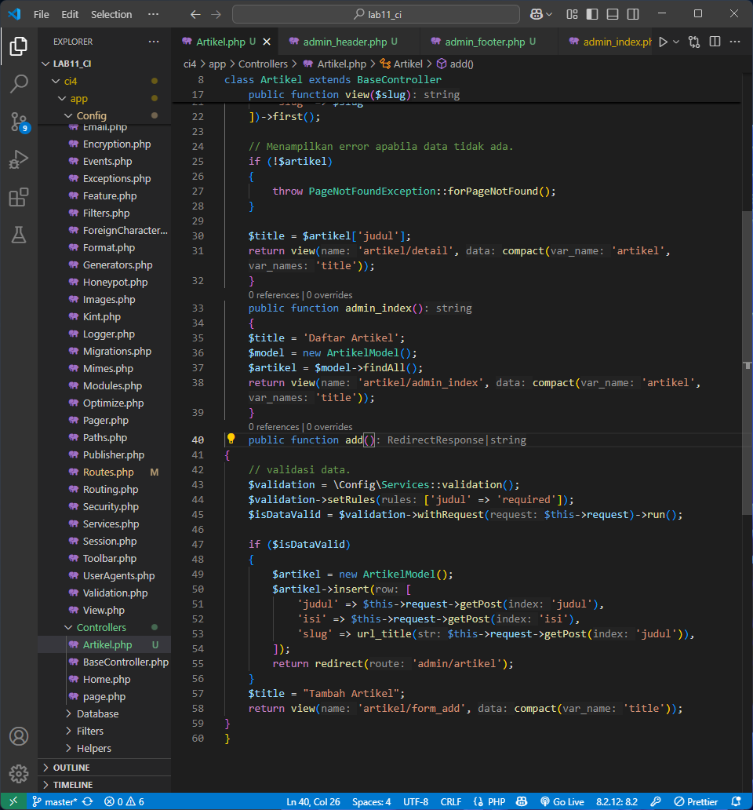
  
- Fitur edit data dengan method edit() dan form_edit.php
  
  
- Implementasi hapus data dengan method delete()
  

### Enhancement Tambahan
1. Styling CSS untuk Admin Panel
   
2. Feature upload gambar
   
3. Sistem pencarian artikel
   

#### Hasil Akhir Lab 2

## Lab 3: Template Layout dan Komponen View

### Arsitektur Layout
- Pembuatan folder layout dengan file main.php sebagai template utama
  
- Refactoring seluruh view (home.php, about.php, contact.php, index.php, detail.php) untuk menggunakan layout terpusat
  
  
  
  
  

### Database Enhancement
- Penambahan field timestamp (created_at) pada tabel artikel
  

### View Cell Implementation
- Pembuatan folder Cells dengan class ArtikelTerkini.php
  
- Development view komponen di folder components/artikel_terkini.php
  
- Implementasi sistem kategorisasi artikel dengan filter
  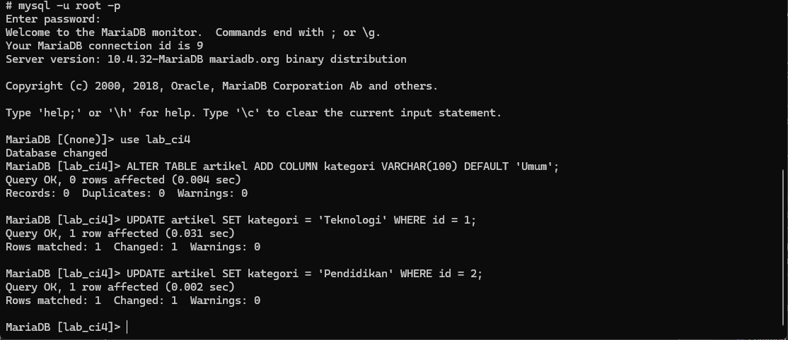
  
  
  
  

### Modifikasi View Cell dengan Parameter Kategori
- Modifikasi method render() untuk menerima parameter kategori
  
- Pemanggilan View Cell dengan parameter kategori
  

#### Hasil Akhir Lab 3

### Analisis Konseptual

**Keunggulan View Layout:**
1. **Uniformitas Interface**: Menjamin konsistensi tampilan di seluruh aplikasi
2. **Separation of Concerns**: Memisahkan struktur layout dari konten spesifik
3. **Code Reusability**: Template dapat digunakan berulang tanpa duplikasi
4. **Maintenance Efficiency**: Update layout hanya perlu dilakukan di satu lokasi
5. **Development Speed**: Fokus pengembangan pada konten tanpa mengulang struktur

**Perbandingan View Cell vs View Konvensional:**

| Aspek | View Konvensional | View Cell |
|-------|------------------|-----------|
| **Fungsi Utama** | Rendering halaman lengkap | Komponen UI modular |
| **Pemanggilan** | `return view()` | `view_cell()` |
| **Logic Business** | Minimal, data dari controller | Dapat memiliki logic sendiri |
| **Reusability** | Terbatas | Sangat fleksibel |
| **Isolation** | Share context | Konteks terpisah |

## Lab 4: Sistem Autentikasi

### Infrastructure Authentication
- Pembuatan tabel user di database
  
- Development UserModel.php
  
- Controller User.php dengan method login/logout
  
- Design interface login.php
  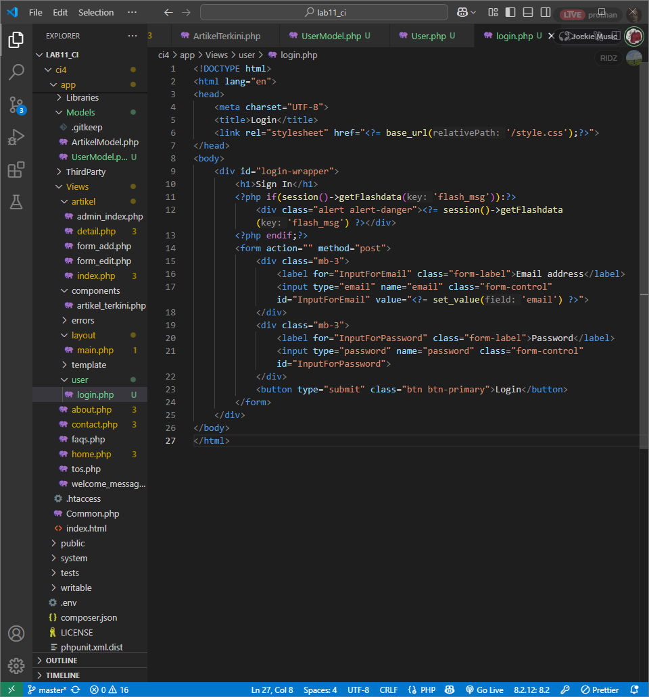
  

### Security Implementation
- Database seeder untuk data dummy user
  
  
  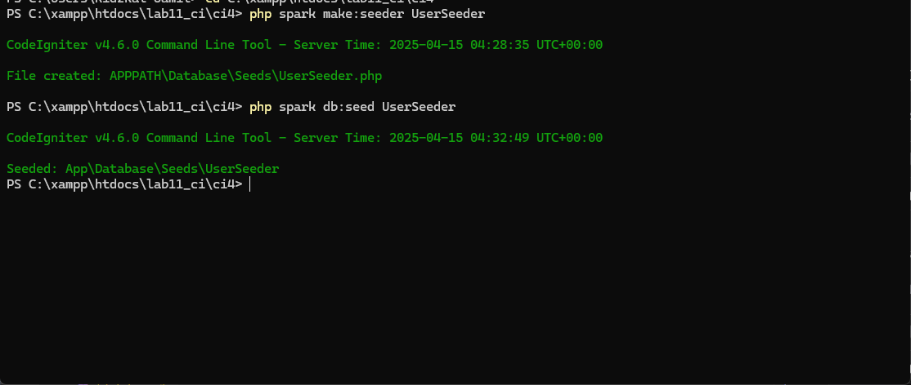
- Auth Filter untuk proteksi halaman admin
  
  
  
- Implementasi fungsi logout dengan session management
  

### Feature Extension
1. Halaman registrasi user baru
   
   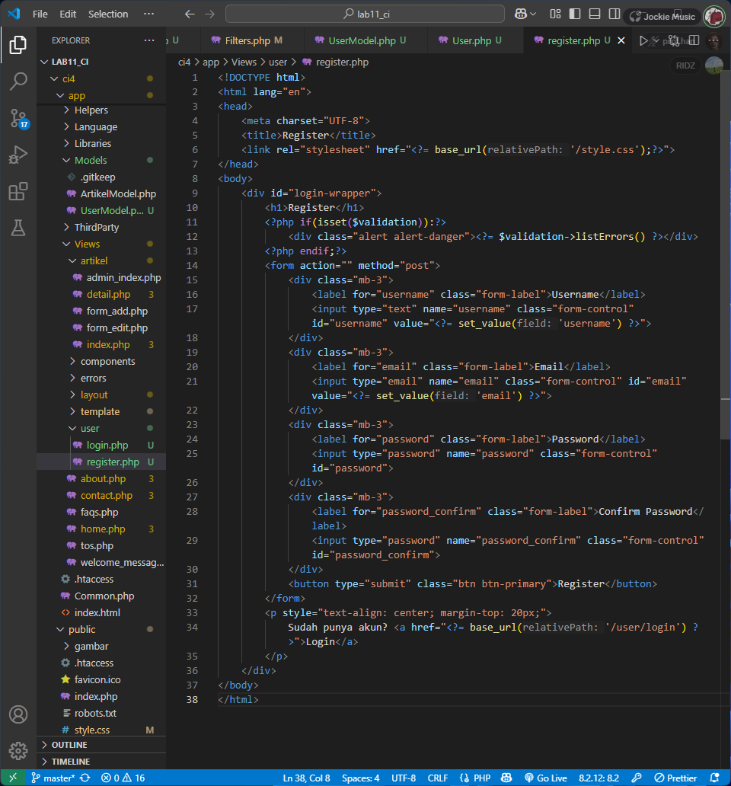
   

2. Dashboard admin dengan statistik
   
   
   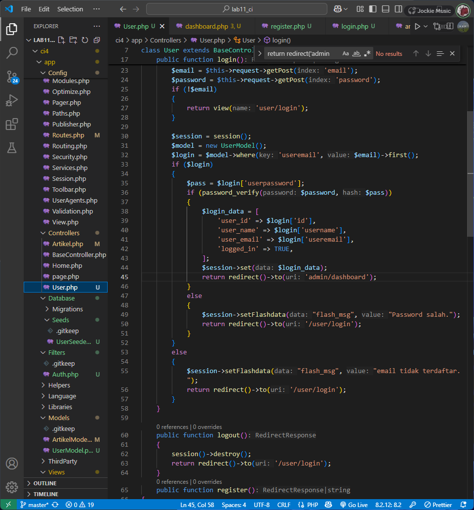
   

3. Enhancement UI dengan styling CSS
   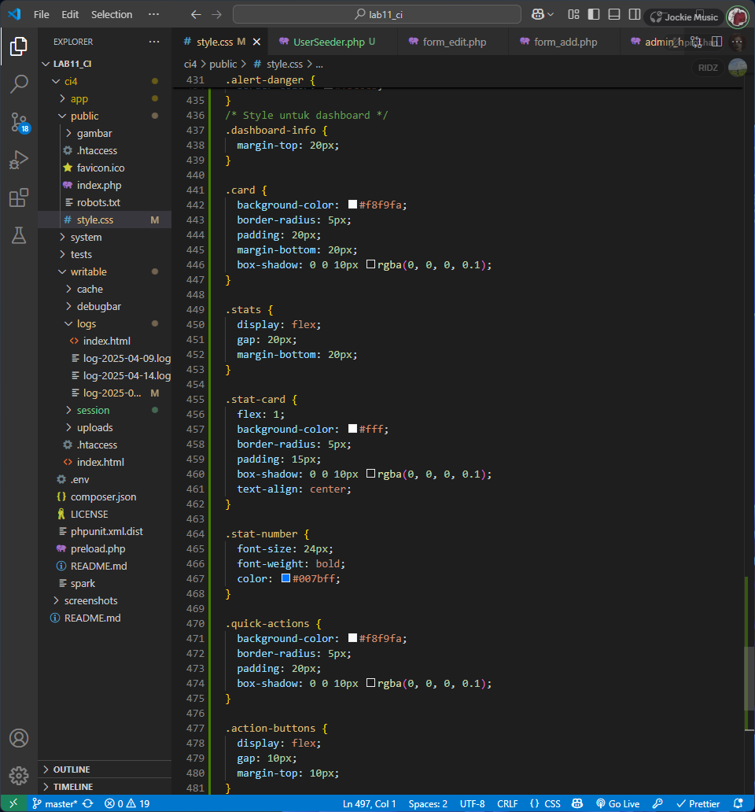

#### Hasil Akhir Lab 4

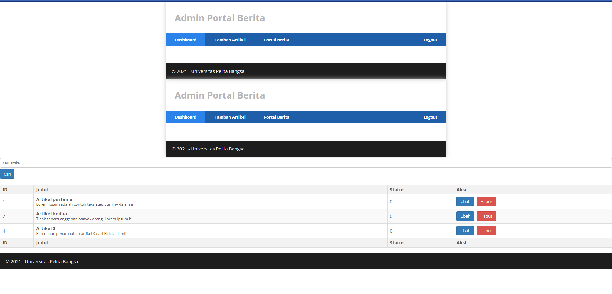

## Lab 5: Pagination dan Search System

### Pagination Implementation
- Modifikasi Controller Artikel untuk pagination
  
  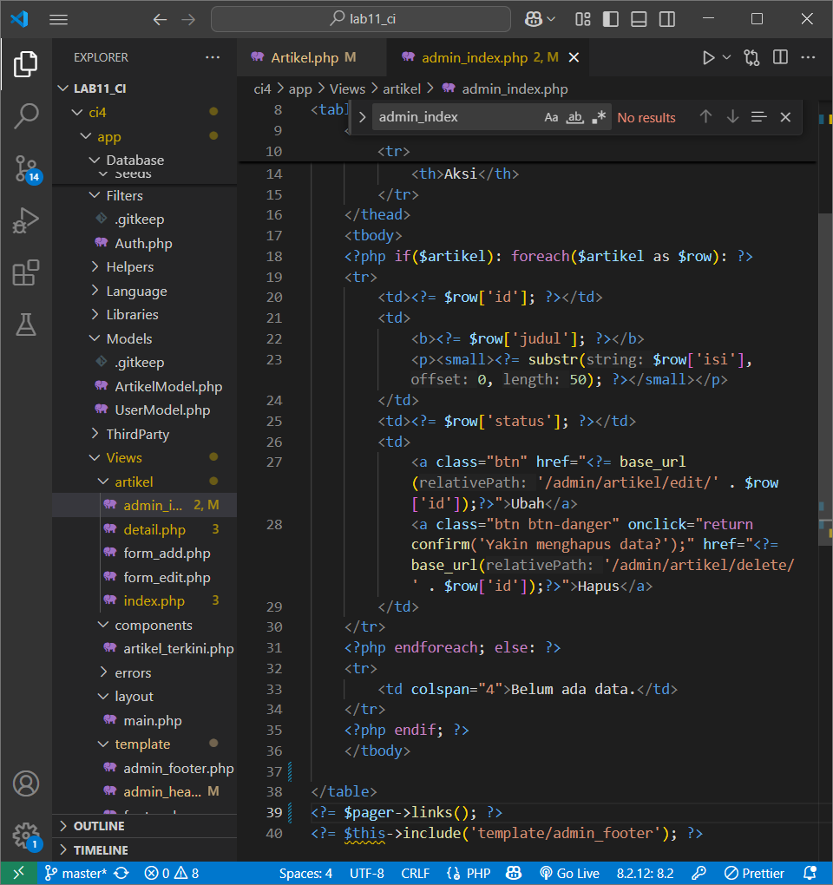
- Update view admin_index.php dengan navigasi halaman
  

### Search Functionality
- Enhancement method `admin_index` dengan fitur pencarian
  
  
- Implementasi form search di interface
  
  
- Filter berdasarkan kategori dengan counter hasil
  
  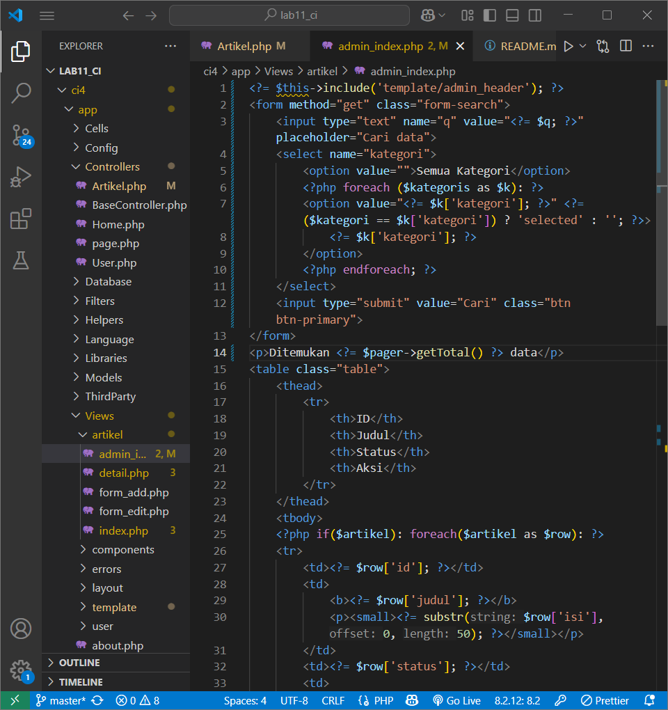

#### Hasil Akhir Lab 5

## Lab 6: File Upload Management

### Upload System
- Modifikasi method add() untuk handle file upload
  
- Update form_add.php dengan input file dan encryption type
  
- Testing upload functionality dengan berbagai format gambar
  
  

#### Hasil Akhir Lab 6

## Lab 7: Database Relations dan Query Builder

### Relational Database Design
- Pembuatan tabel kategori dengan struktur lengkap
  
- Implementasi foreign key constraint ke tabel artikel
  
  
  
- Development KategoriModel.php
  

### Advanced Querying
- Modifikasi ArtikelModel dengan method JOIN
  
- Update controller untuk menggunakan relasi tabel
  
- Enhancement semua view untuk menampilkan data kategori
  
  
  
  
  
  
  

### Features Enhancement
- Testing dan validasi semua fitur
  
  
  
  
  

#### Hasil Akhir Lab 7

## Lab 8: AJAX Integration

### AJAX Infrastructure
- Integrasi pustaka jQuery ke project
  
- Pembuatan AjaxController.php untuk request handling
  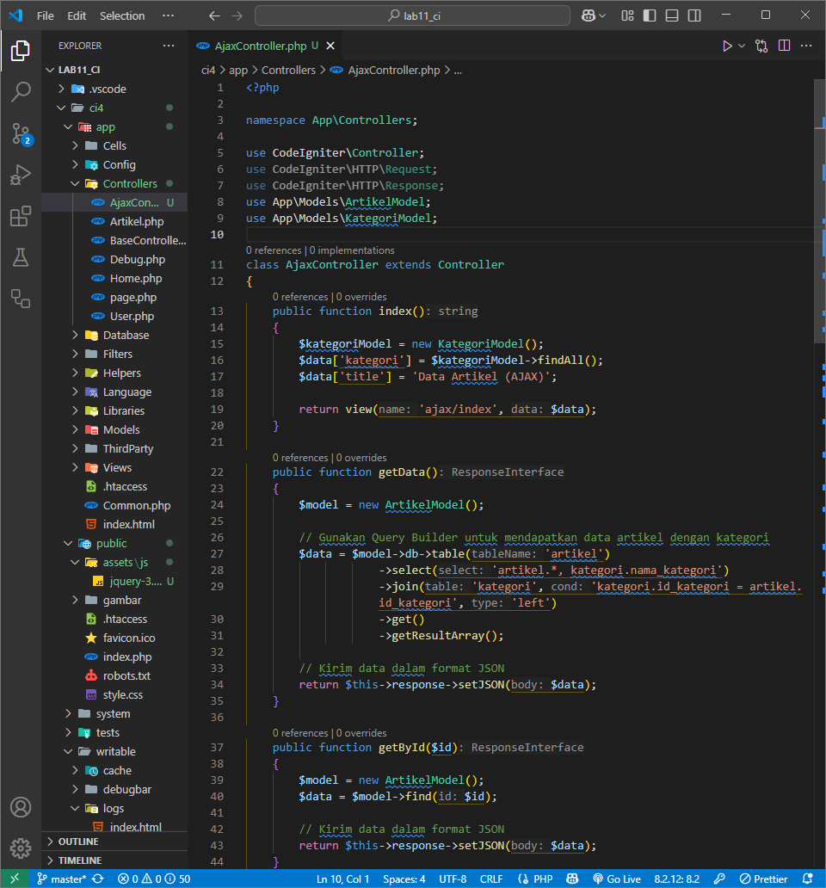
- Konfigurasi routing khusus AJAX
  

### Dynamic Functionality
- Implementasi view dengan AJAX loading
  
  
- Fitur pencarian real-time
- Filter kategori tanpa reload halaman

### Advanced Features
- Fungsi tambah dan edit data via AJAX
- Enhancement dengan search dan filter kategori

#### Hasil Akhir Lab 8

## Lab 9: Advanced AJAX Features

### Data Management
- Preparasi dataset besar untuk testing pagination
  
- Refactoring method admin_index() untuk AJAX support
  

### Interactive Interface
- Implementasi interface AJAX dengan fitur lengkap:
  - Search real-time implementation
  - Dynamic category filtering
  - Pagination tanpa reload halaman
  - Column sorting functionality
  

### User Experience Enhancement
- Response time optimization
- Responsive interface design
- Advanced sorting dan export features

#### Hasil Akhir Lab 9

## Lab 10: REST API Development

### API Infrastructure
- Setup environment dengan Postman
  
- Database configuration untuk API
- Development REST Controller Post.php
  

### API Endpoints Implementation
- Resource routing configuration
  
- Verifikasi routing dengan command line
  

### API Testing Results
- **GET All Data**: Retrieval semua artikel
  
- **POST**: Penambahan artikel baru
  
- **GET by ID**: Retrieval artikel spesifik
  
- **PUT**: Update artikel existing
  
- **DELETE**: Penghapusan artikel
  

### API Response Format
Semua endpoint menggunakan JSON response format dengan proper HTTP status codes untuk error handling dan success responses.

## Kesimpulan Praktikum

Serangkaian praktikum ini memberikan pemahaman komprehensif tentang:
- Arsitektur MVC dalam CodeIgniter 4
- Database operations dan relational design
- Modern web development techniques (AJAX, REST API)
- Security implementation dengan authentication system
- UI/UX enhancement dengan responsive design
- Performance optimization dengan pagination dan caching

Implementasi praktikum ini menghasilkan aplikasi web full-featured dengan admin panel, sistem kategorisasi, file upload, dan API endpoints yang siap untuk deployment production.
